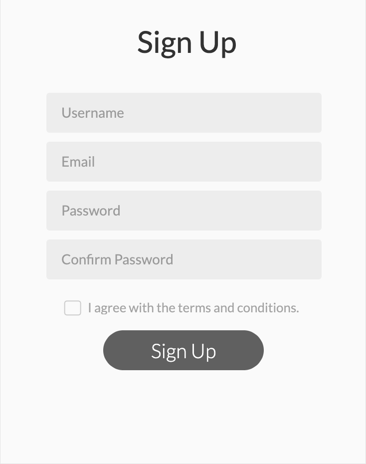
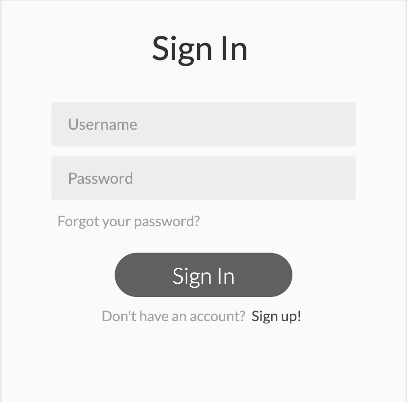
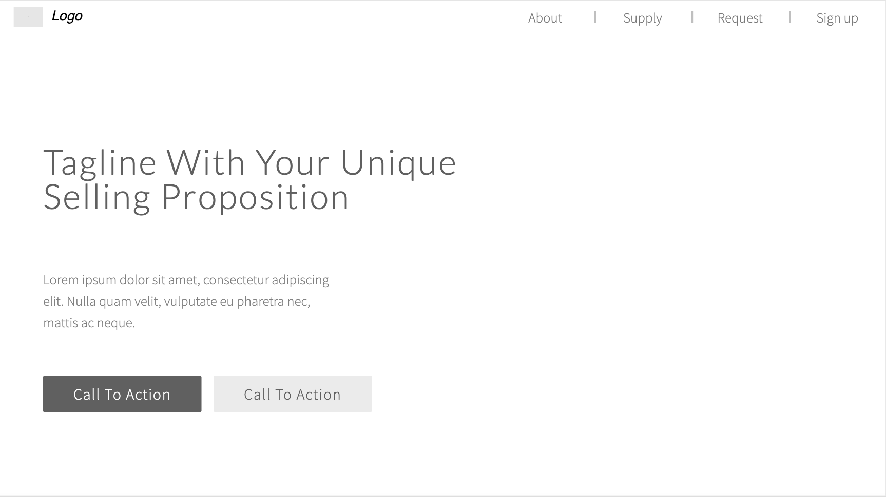
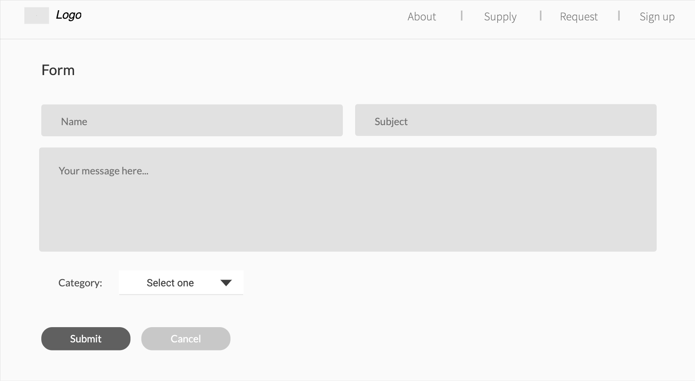
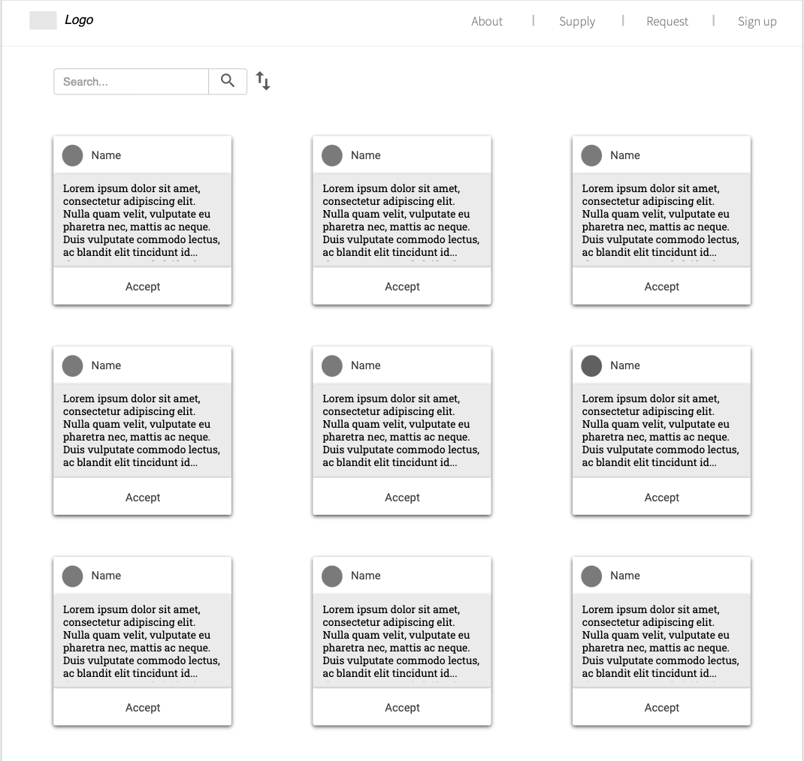
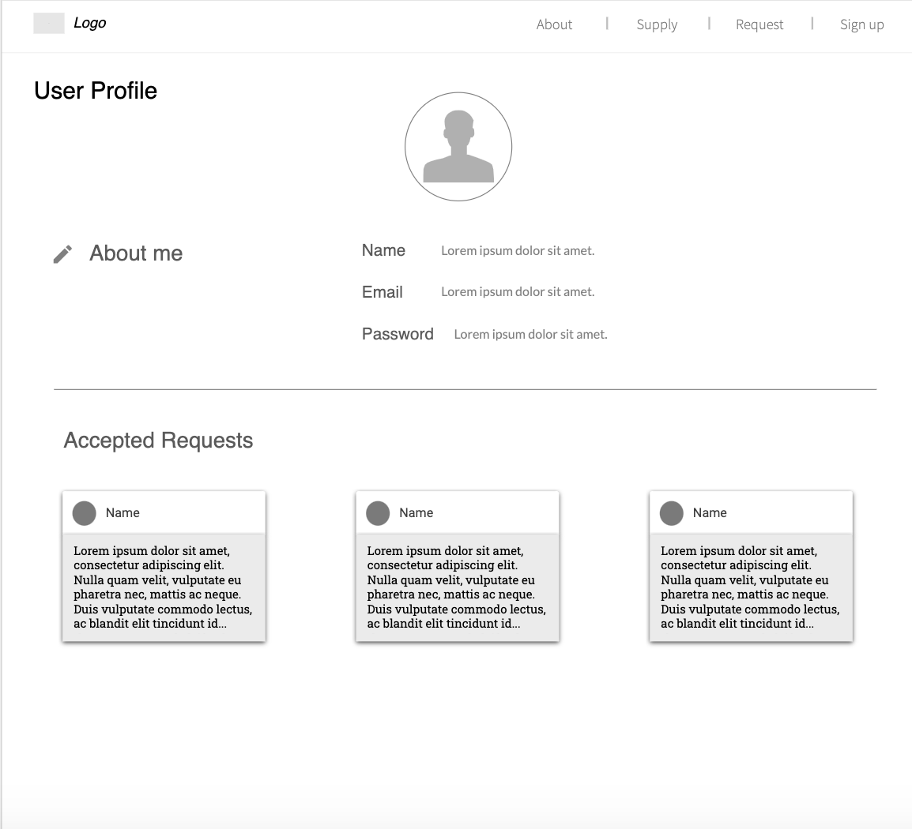
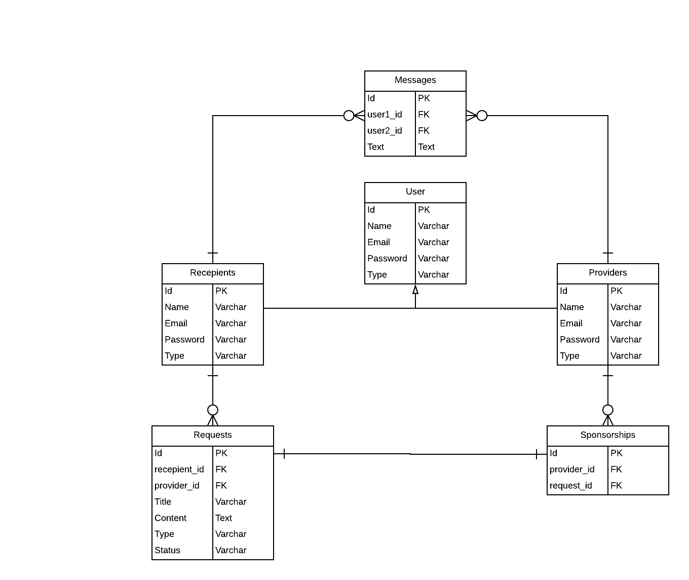

# GA Project#4: Aidsation

This project was built as a requirement in Misk Academy-General Assembly Software Engineering Course.

## Table of Contents

* Overview
* User Stories
* Wireframes
* ERD
* Technologies Used
* Future Work

## Overview 

This project is built to support people in need of foods, clothes or anything they could need. In addition, It allows the users to trade between each other.

## User Stories

V0:

* As a recipient, I want to be able to sign up to the system, so that I can later on sign in and post requests.

* As a recipient, I want to be able to sign in into the system, so that I can post requests.

* As a recipient, I want to be able to sign out from the system, so that another user can sign in from the same machine.

* As a recipient, I want to post a request, so that other people can help me.

* As a recipient, I want to edit my request, so that it can ease the use of the posting requests system.

* As a recipient, I want to delete my request, so that it ease the providers' experience of accepting requests.

V1:

* As a recipient, I want to see all my posted requests, so that I can see the status of my requests.

* As a provider, I want to be able to sign up to the system, so that I can  later on sign in and accept requests.

* As a provider, I want to be able to sign in into the system, so that I can accept requests.

* As a provider, I want to be able to sign out from the system, so that another user can sign in from the same machine.

* As a provider, I want to see all posted requests from other people, so that I can accept them.

V2:

* As a provider, I want to be able to accept request, so that I can support people in need.

* As a provider, I want to see requests that I accepted, so that I can contact the requester.

* As a provider, I want to be able to un accept a request, so that the recipient can be helped by other people.

## Wireframes 

* Sign up

* Sign in

* Landing Page

* Request Form

* Display Requests

* Profile

## ERD

## Technologies Used

* Ruby
* Rails
* HTML
* CSS
* SASS
* Bootstrap
* Github
* Lucidchart
* Trello

## Future Work

* Add a search feature.

* Enable the provider to filter the requests based on categories.

* Add a messaging feature between the recipient and provider.

* Add an admin user

* Enable the admin to delete users

* Integerate the app with delivery service apps
